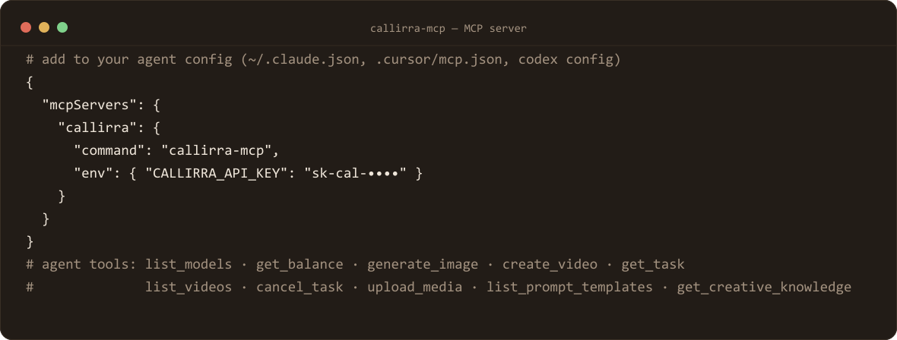

# @callirra/mcp

[](https://www.npmjs.com/package/@callirra/mcp)
[](#requirements)
[](#license)
[](https://modelcontextprotocol.io/)

MCP server for Callirra — lets Claude Code, Cursor, Codex and other MCP-compatible agents discover models, generate images/videos, use the built-in prompt templates, upload references, poll tasks and check balances.



## Requirements

> ⚠️ **The built-in template catalogue was retired (Sep 2026)**: `PROMPT_TEMPLATES` is now an empty array,
> `GET /api/v1/prompts/templates` returns an empty list, and any `templateId` call returns 404. References to
> built-in templates or `--template-id` below are historical — use the prompt box or `prompts/enhance` instead.

- Node.js 22+
- A Callirra API key (`sk-cal-...`)

## Install

> **This repository is the standalone copy.** The server is developed inside the Callirra monorepo and
> mirrored here; `src/data/*.json` is generated from Callirra's own prompt library by
> `scripts/build-data.mjs` there — it is committed here so the package installs and runs on its own.

```bash
npm install -g @callirra/mcp
```

Get an API key at [callirra.com](https://callirra.com?utm_source=github-mcp).

## Configure

```bash
export CALLIRRA_API_KEY=sk-cal-xxxxxxxxxxxxxxxx
```

Optional:

```bash
export CALLIRRA_API_BASE=https://api.callirra.com
```

## Run

```bash
callirra-mcp
```

### Claude Code

Add the MCP server to your Claude Code config with:

```json
{
  "mcpServers": {
    "callirra": {
      "command": "callirra-mcp",
      "env": {
        "CALLIRRA_API_KEY": "sk-cal-xxxxxxxxxxxxxxxx"
      }
    }
  }
}
```

### Cursor / Codex

Use the same `callirra-mcp` command as the MCP server entry and pass `CALLIRRA_API_KEY` in the environment.

## Available tools

| Tool | Purpose |
|---|---|
| `list_models` | List available image/video models |
| `get_balance` | Check credits and available balance |
| `get_usage` | Show recent usage |
| `generate_image` | Generate an image (supports `nsfw_checker`, `google_search`) |
| `create_video` | Create an async video task (supports v2v refs, seed, modes, `return_last_frame`, NSFW/search toggles) |
| `list_videos` | List recent video tasks |
| `get_task` | Get task status |
| `cancel_task` | Cancel task |
| `upload_media` | Upload a reference image (base64, ≤6MB) |
| `list_prompt_templates` | List built-in prompt templates |
| `enhance_prompt` | Enhance an idea with a built-in template |
| `get_creative_knowledge` | Get the full curated creative knowledge base |

Each tool returns `isError` responses on failures so agents can handle errors gracefully.

## License

MIT. Source: [github.com/callirra-ai/mcp](https://github.com/callirra-ai/mcp?utm_source=github-mcp)

## Related

- [GPT Image 2.5 Prompt Atlas](https://github.com/callirra-ai/gpt-image-2-5-prompt-atlas) — 50 prompts, each shipped with the exact frame it produced, plus a measured Flare-vs-Sunburst comparison
- [CLI](https://github.com/callirra-ai/cli?utm_source=github-mcp) · [Agent skill](https://github.com/callirra-ai/skill?utm_source=github-mcp) — the same catalogue for terminals and skill-enabled agents

---

→ Start free at [callirra.com](https://callirra.com?utm_source=github-mcp)
